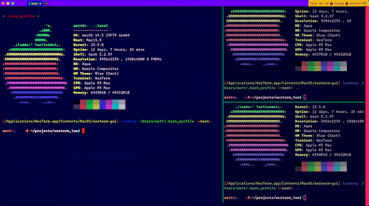

# A custom WezTerm (command line terminal) configuration and color scheme

This WezTerm config provides a colorization scheme with deep hues, eye-popping highlights, and improved hotkey definitions. Specifically for the MacBook Pro and Apple Aluminum keyboard.

-----

Originally designed on
- Apple MacBook Pro M3 Max
- Mac OS X Sonoma 14.5 23F79 arm64
- Darwin 23.5.0

-----



Also compatible (most options) with Linux RHEL9 and Xwindows desktop managers.

Requires some modification for optimal UI/UX on Wayland.

-----

## 1. Installation

It does (obviously) require WezTerm and some command line skills

__Install WezTerm (from iTerm), like so:__

```sh
brew install wezterm
```

## 2. Usage

__Copy `wezterm.lua` to your home folder, with a dot, and it will be auto-loaded:__

```sh
cp wezterm.lua $HOME/.wezterm.lua
```

-----

That's all, folks!

<matt.a.feenstra@gmail.com>
